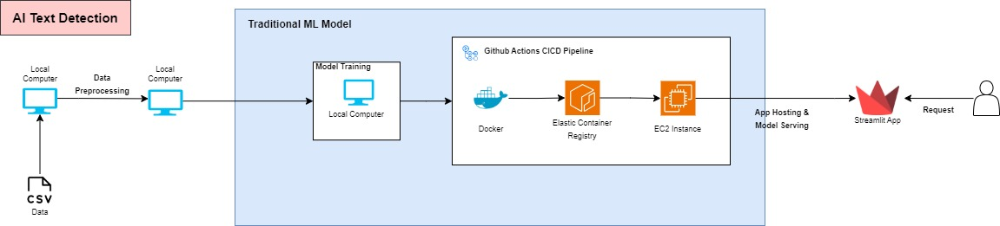
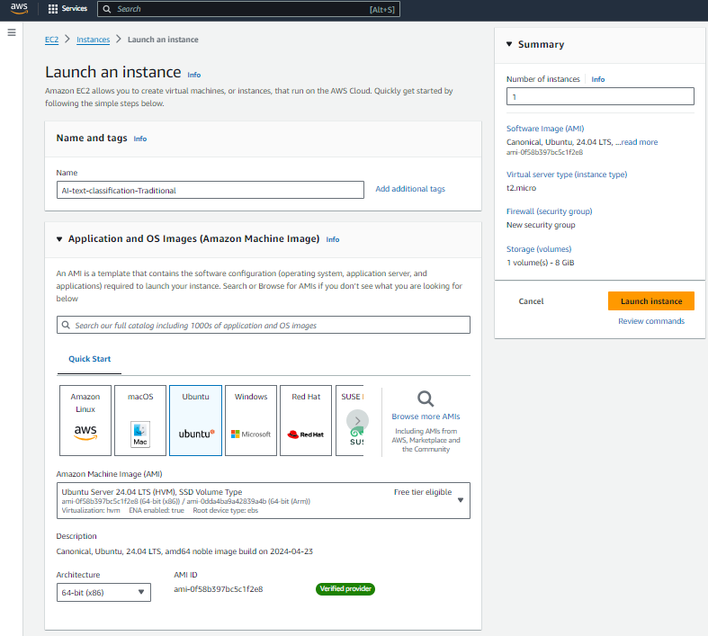
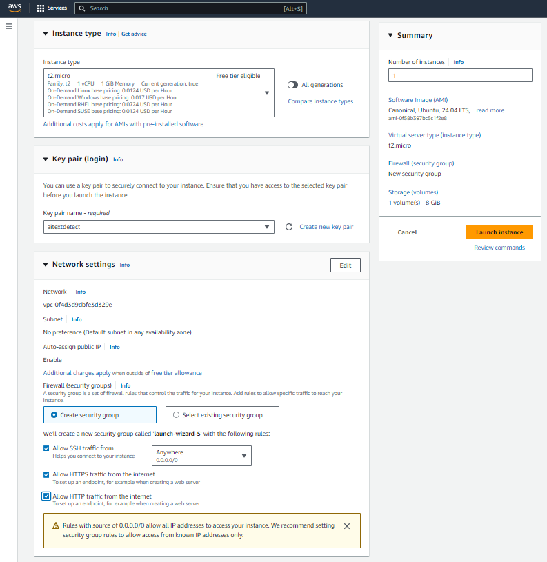
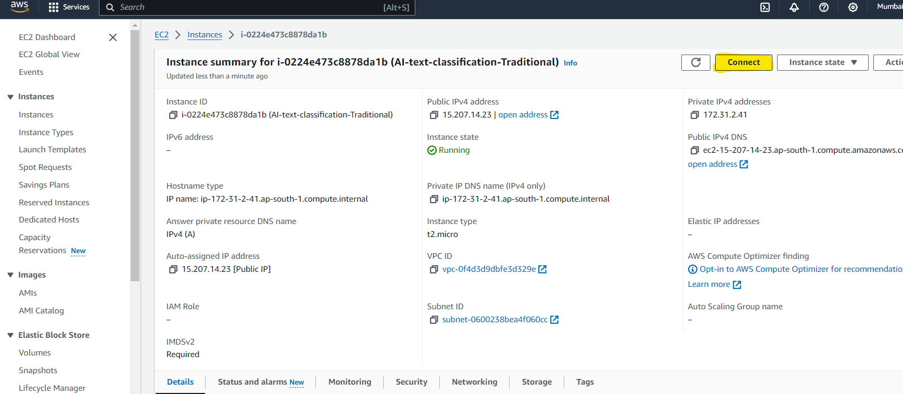
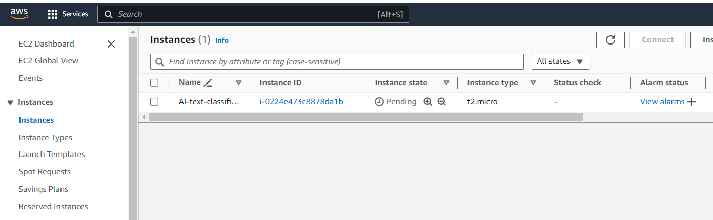
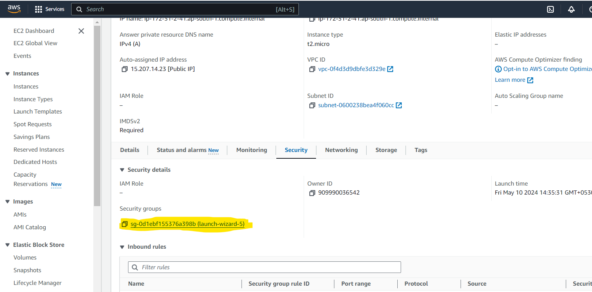
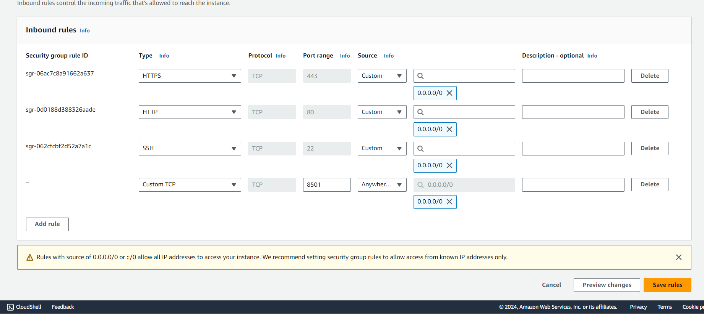

# Traditional Model Deployement for Text Classification

This model was trained using ensemble model of traditional ML algorithms such as RandomForestClassifier, Linear SVC, Naive Bayes etc.

## AWS Architecture



The above architecture was used for the deployement of the traditional ML model. The model was trained and dockerized locally, then image was uploaded to Elastic Container Registry (ECR), then EC2 instance was created to run and deploye the container using this image and serve users.

## Instructions

The deploy your model using the AWS and CICD-pipeline using github actions as shown in above architecture, use the following instructions.

Once you have train your model locally and get the model artifacts in 'model' directory. follow the below steps.

### 1. Create a Dockerfile

In your main directory, create a new file with name 'Dockerfile'

```
#Dockerfile

FROM python:3.10-slim

RUN apt update -y && apt install awscli -y
WORKDIR /app

COPY . .

RUN pip install --no-cache-dir -r requirements.txt

# Expose the port that Streamlit runs on
EXPOSE 8501

# Command to run the Streamlit application
CMD ["streamlit", "run", "app.py", "--server.port=8501", "--server.address=0.0.0.0"]
```

This dockerfile will create an image using python-3.10 image, copying all the files from your code, installing all the dependencies form requirements.txt file, exposing 8501 port as it is default streamlit port, and then running app.py file using streamlit.

## 2. Build a docker image and push to ECR

Once you have Dockerfile ready in your main directory, open AWS console and create new IAM user with the following permissions

```
#Policy:

1. AmazonEC2ContainerRegistryFullAccess
2. AmazonEC2FullAccess
```

Then, generate an access key and secret key for this IAM user.

Once you have the access key and secret key, you can configure Docker to use these credentials for ECR authentication. You can set the AWS credentials as environment variables:

```
export AWS_ACCESS_KEY_ID=<your-access-key>
export AWS_SECRET_ACCESS_KEY=<your-secret-key>
```

Now, you can use Docker to log in to ECR:

```
docker login -u AWS -p $(aws ecr get-login-password --region <your-region>) <your-account-id>.dkr.ecr.<your-region>.amazonaws.com
```

Navigate to your main code directory containing the Dockerfile and build the Docker image:

```
docker build -t <your-image-name> .
```

Tag the Docker image with the ECR repository URI:

```
docker tag <your-image-name>:latest <your-account-id>.dkr.ecr.<your-region>.amazonaws.com/<your-repository-name>:latest
```

Finally, push the Docker image to your ECR repository:
```
docker push <your-account-id>.dkr.ecr.<your-region>.amazonaws.com/<your-repository-name>:latest
```

## 3. Start an EC2 Instance and install docker

Now that you have pushed an image to your ECR repo, we will use it in our EC2 instance. 

First, Login into your AWS console and navigate to EC2 dashboard. Click on 'Launch Instance' to create a new instance. Then, select your instance name, OS and machine images. We have selected as shown in the image below.



Then select instance type and key-pair value as per your requirements. Then check all the boxes in network settings as shown below:



Now, launch your instance. Now go back to instance dashboard. Once it starts running you will see following screen:




Now open the instance, and connect to the instance as shown below. It will open the terminal type window.



Now apply the following commands one by one to install docker on the EC2 machine

```
#optinal

sudo apt-get update -y

sudo apt-get upgrade

#required

curl -fsSL https://get.docker.com -o get-docker.sh

sudo sh get-docker.sh

sudo usermod -aG docker ubuntu

newgrp docker
```
to check if the docker is installed, apply following command
```
docker --version
```

## 4. Start the Docker Container and Run the Application
Once the docker is installed, Authenticate Docker with ECR using the same command as before:

```
docker login -u AWS -p $(aws ecr get-login-password --region <your-region>) <your-account-id>.dkr.ecr.<your-region>.amazonaws.com
```

Then, pull your Docker image:

```
docker pull <your-account-id>.dkr.ecr.<your-region>.amazonaws.com/<your-repository-name>:latest
```

Finally, run your Docker container using the following command:
```
docker run -d -p <host-port>:<container-port> <your-account-id>.dkr.ecr.<your-region>.amazonaws.com/<your-repository-name>:latest
```

Since, we are running streamlit application, we will apply 8501:8501 in place of 'host-port' & 'container-port'.

Your Docker container should now be running on your EC2 instance.

Now in the last part that we need to add permission to access the EC2 instance, open the EC2 instance and go to security and click on the security group



Now, click on edit inbound rules -> Add rule

Type=Custom TCP, Port=8501, Source=Anywhere, and 0.0.0.0/0

Then, click save rules.



Congratulation! your streamlit application is ready. Now go to instance and copy Public IPv4 address in your browser and add ':8501' at the end. It should look like:

```
<Public IPv4 address>:8501
```

You will see your streamlit application. Now paste any text in your application and get the prediction.

Now, we will automate all this steps by implementing GIthub Actions CICD pipeline.

## 5. Automate CICD with Github Actions

Now to automate, this deployement, we will have to add Github actions workflow file 'main.yaml' as follows:

1. create main.yaml file under .github/workflows directory.

```
# main.yaml
name: workflow

on:
  push:
    branches:
      - main
    paths-ignore:
      - 'README.md'

permissions:
  id-token: write
  contents: read

jobs:
  integration:
    name: Continuous Integration
    runs-on: ubuntu-latest
    steps:
      - name: Checkout Code
        uses: actions/checkout@v3

      - name: Lint code
        run: echo "Linting repository"

      - name: Run unit tests
        run: echo "Running unit tests"

  build-and-push-ecr-image:
    name: Continuous Delivery
    needs: integration
    runs-on: ubuntu-latest
    steps:
      - name: Checkout Code
        uses: actions/checkout@v3

      - name: Install Utilities
        run: |
          sudo apt-get update
          sudo apt-get install -y jq unzip
      - name: Configure AWS credentials
        uses: aws-actions/configure-aws-credentials@v1
        with:
          aws-access-key-id: ${{ secrets.AWS_ACCESS_KEY_ID }}
          aws-secret-access-key: ${{ secrets.AWS_SECRET_ACCESS_KEY }}
          aws-region: ${{ secrets.AWS_REGION }}

      - name: Login to Amazon ECR
        id: login-ecr
        uses: aws-actions/amazon-ecr-login@v1

      - name: Build, tag, and push image to Amazon ECR
        id: build-image
        env:
          ECR_REGISTRY: ${{ steps.login-ecr.outputs.registry }}
          ECR_REPOSITORY: ${{ secrets.ECR_REPOSITORY_NAME }}
          IMAGE_TAG: latest
        run: |
          # Build a docker container and
          # push it to ECR so that it can
          # be deployed to ECS.
          docker build -t $ECR_REGISTRY/$ECR_REPOSITORY:$IMAGE_TAG .
          docker push $ECR_REGISTRY/$ECR_REPOSITORY:$IMAGE_TAG
          echo "::set-output name=image::$ECR_REGISTRY/$ECR_REPOSITORY:$IMAGE_TAG"
          
          
  Continuous-Deployment:
    needs: build-and-push-ecr-image
    runs-on: self-hosted
    steps:
      - name: Checkout
        uses: actions/checkout@v3

      - name: Configure AWS credentials
        uses: aws-actions/configure-aws-credentials@v1
        with:
          aws-access-key-id: ${{ secrets.AWS_ACCESS_KEY_ID }}
          aws-secret-access-key: ${{ secrets.AWS_SECRET_ACCESS_KEY }}
          aws-region: ${{ secrets.AWS_REGION }}

      - name: Login to Amazon ECR
        id: login-ecr
        uses: aws-actions/amazon-ecr-login@v1
      
      
      - name: Pull latest images
        run: |
         docker pull ${{secrets.AWS_ECR_LOGIN_URI}}/${{ secrets.ECR_REPOSITORY_NAME }}:latest
         
      #- name: Stop and remove container if running
      #  run: |
      #    docker ps -q --filter "name=cnncls" | grep -q . && docker stop cnncls && docker rm -fv cnncls
       
      - name: Run Docker Image to serve users
        run: |
         docker run -d -p 8501:8501 --name=cnncls -e 'LAMBDA_API_URL=${{ secrets.LAMBDA_API_URL }}' -e 'LAMBDA_API_IMAGE_ENDPOINT=${{ secrets.LAMBDA_API_IMAGE_ENDPOINT }}' -e 'AWS_ACCESS_KEY_ID=${{ secrets.AWS_ACCESS_KEY_ID }}' -e 'AWS_SECRET_ACCESS_KEY=${{ secrets.AWS_SECRET_ACCESS_KEY }}' -e 'AWS_REGION=${{ secrets.AWS_REGION }}'  ${{secrets.AWS_ECR_LOGIN_URI}}/${{ secrets.ECR_REPOSITORY_NAME }}:latest
      - name: Clean previous images and containers
        run: |
         docker system prune -f
```
Note: when you are running for second time, comment out the whole 'Stop and remove container if running' part. 

2. Open your github repository -> settings -> actions -> runner -> new self hosted runner -> choose os -> then run command one by one on your EC2 machine.

3. In your github repo settings, open secrets & variables -> actions. Add environment variables as below.

Note: To find your ECR login URI and Repo name, open your ECR dashboard and select the repository where you have deployed the image. You will see something similar like '722173416292.dkr.ecr.us-east-1.amazonaws.com/simple-app', where first part is Login Uri and second part is your repo name.

```
AWS_ACCESS_KEY_ID=

AWS_SECRET_ACCESS_KEY=

AWS_REGION = us-east-1

AWS_ECR_LOGIN_URI = sample>>  722173416292.dkr.ecr.us-east-1.amazonaws.com

ECR_REPOSITORY_NAME = simple-app
```


4. Now your CICD pipeline is ready. Push any chages to Github repo and it will automatically be applied to your application.


