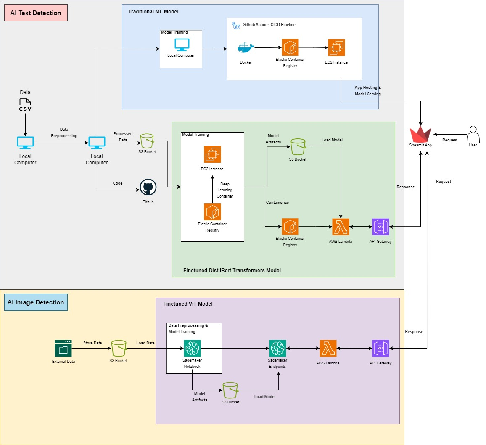

# AI Text-Image Detection App

This repository contains an AI Text-Image Detection app that can determine whether a given input, either text or image, was generated by an AI model or not.

## Functionality

The AI Text-Image Detection app provides the following functionality:

- **Text Detection:** Users can input text, and the app analyzes it to determine whether it was generated by an AI model or not.
- **Image Detection:** Users can upload an image, and the app performs image analysis to detect whether the image was generated by an AI model or not.

## Model's Used:
Three different models are used, which are as follows:

- **Traditional ML Model (Text):** This model was trained using ensemble model of traditional ML algorithms such as RandomForestClassifier, Linear SVC, Naive Bayes etc.
- **Finetuned DistilBert Model (Text):** The transformer based deep learning model was fine-tuned on task specific data to detect AI generated text.
- **Finetuned ViT Model (Image):** The vision transformer based deep learning model was fine-tuned on task specific data to detect AI generated images.

## Architecture

The AI Text-Image Detection app was deployed using AWS. The following architecture shows each components used and utilized for different models for training as well as deployement:

## Demo

Check out the following video demo to see the AI Text-Image Detection app in action:

Click on the image above to watch the demo video.

